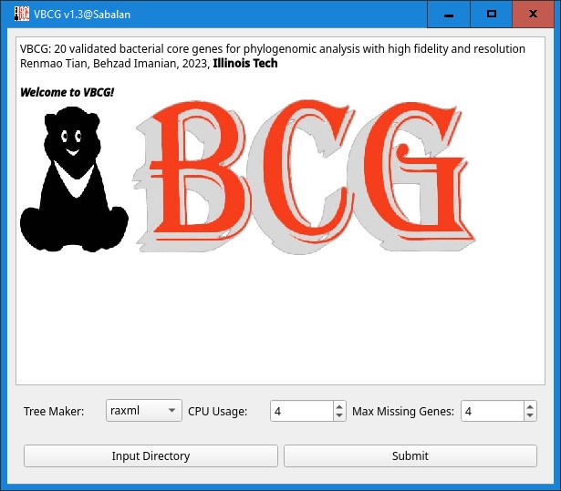

Update: We have built a Galaxy server at http://hts.iit.edu/galaxy. You may go to http://hts.iit.edu/galaxy/?tool_id=vbcg to use it by simply uploading data and setting parameters.
# VBCG: 20 validated bacterial core genes for phylogenomic analysis with high fidelity and resolution
## Abstract
### Background
Phylogenomic analysis has become an inseparable part of studies of bacterial diversity and evolution, and many different bacterial core genes have been collated and used for phylogenomic tree reconstruction. However, these genes have been selected based on their presence and single-copy ratio in all bacterial genomes, leaving out the gene's 'phylogenetic fidelity' unexamined. 
### Results
From 30,522 complete genomes covering 11,262 species, we examined 148 bacterial core genes that have been previously used for phylogenomic analysis. In addition to the gene presence and single-copy rations, we evaluated the gene's phylogenetic fidelity by comparing each gene's phylogeny with its corresponding 16S rRNA gene tree. Out of the 148 bacterial genes, 20 validated bacterial core genes (VBCG) were selected as the core gene set with the highest bacterial phylogenetic fidelity. Compared to the larger gene set, the 20-gene core set resulted in more species having all genes present and fewer species with missing data, thereby enhancing the accuracy of phylogenomic analysis. Using Escherichia coli strains as examples of prominent bacterial foodborne pathogens, we demonstrated that the 20 VBCG produced phylogenies with higher fidelity and resolution at species and strain levels while 16S rRNA gene tree alone could not. 
### Conclusion
The 20 validated core gene set improves the fidelity and speed of phylogenomic analysis. Among other uses, this tool improves our ability to explore the evolution, typing and tracking of bacterial strains, such as human pathogens. We have developed a Python pipeline and a desktop graphic app (available on GitHub) for users to perform phylogenomic analysis with high fidelity and resolution.
### Keywords
Phylogenomics; Bacterial core genes; Phylogenetic tree; Pathogen typing 

## Installation
### Linux
#### Dependencies
- Bio >= 1.5.3<br>
- Pandas<br>
- Prodigal<br>
- HMMER<br>
#### Installing dependencies
To install the dependencies, run:<br>
```bash
conda create -n vbcg python=3.9
conda activate vbcg
pip install biopython pandas
conda install -c bioconda prodigal hmmer
```
Then download this package<br>
```bash
git clone https://github.com/tianrenmaogithub/vbcg.git
chmod 755 vbcg/bin/*
```
and run this for the help message.
```bash
python path_to_vbcg/bin/vbcg.py -h
```
### Windows
Download the <a href='https://zenodo.org/records/10594391/files/vbcg_v1.3_setup.exe?download=1'> <b> installer executable </b> </a> and install it to run the analysis in GUI mode. Click "More Info" and then "Run Anyway" to proceed with the installation.



## Input data
- You need to prepare a directory with separate genome sequence FASTA files (either zipped in .gz or not).
- Do NOT include any non-FASTA files or subfolders.
- Do NOT include spaces in the folder or file names.

You may download this <a href='https://zenodo.org/records/10594429/files/test_genomes.zip?download=1'><b>example input genomes data</b></a> as a reference. Unzip it and feed the <b>directory</b> to the software as the input.

## Citation
If you find our tool helpful, please cite our paper.<br>
Tian, R., Imanian, B. VBCG: 20 validated bacterial core genes for phylogenomic analysis with high fidelity and resolution. Microbiome 11, 247 (2023). https://doi.org/10.1186/s40168-023-01705-9
